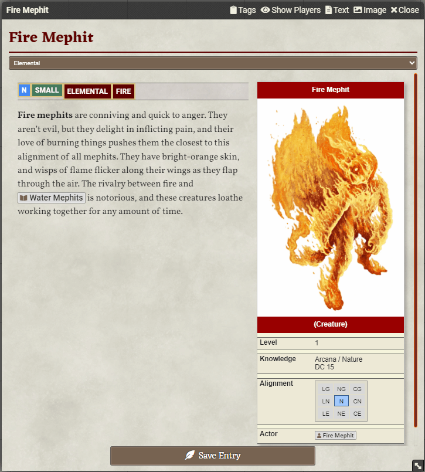

<!--- Downloads @ Latest Badge -->
<!--- replace <user>/<repo> with your username/repository -->

<!--- Forge Bazaar Install % Badge -->
<!--- replace <your-module-name> with the `name` in your manifest -->

# TagIt!

A module to tag entities and then search for them.

* Add tags to JournalEntries, Actors, Items, Tokens, and Compendium entires
* Search for tags by pressing Ctrl-Shift-F
* Open items from search
* Drag the results to where you need

# New Features in 0.4!

* You will only receive the results for documents you have permission to view!  Sorry metagamers...
* New and improved index! Enables new capabilities such as:
  * Using predicates in `search(predicate, options)` API!
  * New `find(predicate)` API call!
  * Search results returned include a `.document` property that will retrieve the document for you!
* Added sort to tags!  Find under the tag management in options.
* Added meta tags!  Now you can make things messier adding `alignment:neutral` everywhere...
  * You can turn off displaying a meta tag in the settings
* Unflagged searches now search tags and names!
* Added notifications when tags are modified on objects

# Demo

## Search

Search for items by tag, opening them directly from the search panel.

## Add Tag to Entity

Add an existing or new tag.

* Open entity
* Click `Tags` on the title bar
* Select an already existing tag or create your own
* Close to save

This demo searched for the tag `small`, which does not exist.  We open a journal and add that new tag.  We click refresh in the search to see the results.

## Advanced Search

Search by sets.

* `||` performs a union
* `&&` performs an intersection
* `()` creates a group

Search by by tag and filter by a value

`[tag][operator][value]`

* Operators include `:`, `=`, `>`, `>=`, `<`, `<=`
* Value is any numerical digit

## Global search and filters

Look for any item by name or type, even ones you haven't tagged.

* `name:`, shortcut `n:` search for part of a name
* `type:`, shortcut `t:` with a document type of `actor`, `item`, `scene`, `journal`, `token`.  Also accepts `a`, `i`, `s`, `j`, `t`.

## Colors

Change the color of a tag

## Meta Tags & Sort

Add an alignment meta tag with a tag of `N` for Neutral.  However, when we search, we see it labeled as `alignment:N`.  We want to see it just as `N`.  Also a different color.  And sorted to the front of the tag list.  At the end, our new alignment tag only displays `N` and is at the front of the tag list.

# TODO

* CSV Import - Adding tags to individual items is a lot of work...
* CSV Export - You're going to want to save your data sometime.

# Compatibility

* PF2e - Tested
* DnD5e - Tested
* Any system that does not make significant changes to the way JournalEntries, Actors, Items, Tokens, and Compendiums are accessed.

# Changelog

## v0.4

* All searchable documents, except tokens, are added to an index that is maintained as documents are added, modified, and removed.
* Unified index documents to ensure data consistency on results.
* `sort:Number` can be added to a tag.
  * Default is under settings (100).
  * Lower numbers sort earlier.
* `meta:String` can be added to a tag.
  * Represented in text as `String:String`.  Differs from value tags that have `String:Number`.
  * Can search for meta with `meta:String`.
  * Individual tags can have their meta not dispaly in search results.
* Unflagged search strings will now search tags and names.
* Added many notifications when documents are modified.
* Fix: When searching for a name compendiums were not being returned
* Fix: When searching, an item that had a `'`, such as `falcon's` would fail
* Fix: Tokens that are linked to their actor were showing twice in search results
* Fix: You can only get results that you have permissions for.
* Fix: When quoting a tag on enter, should now remove quotes.

## v0.3

* Refactored tags to objects with structure `{tag:String, value?: Int, color?: {tag:String, text:String}}`.
* Added migration from v0.2 tag structure to be run on `init`.
* Implemented search tokenizer and parser to union, intersect and recursively group items.
* Search assumes `&&` if no merge token found.
* Added limit to search results, default of 20 items.
* Implemented `draggable="true"` and population of import data.
* Invalid search strings will provide UI error.
* Added `Scene` support.
* Refactored inputs to partials where appropriate
* Basic validation to prevent tags with same name as search tokens.
* `PackCache` now indexes on `init` and only reindexes on compendium change.
* Added color support per tag globally.
* Added default color options.
* Fixed sorting search results by name.
* Fixed `Scene` were not removed when removing all tags.

## v0.2

* Standardized tags to `span` objects to be used throughout
* Included all tags on search
* Entity type is visually represented as a tag
* Can manage tags in module settings including
  * Renaming tags
  * Removing individual tags
* Remove all tags in module settings

## V0.1.0
The beginning

