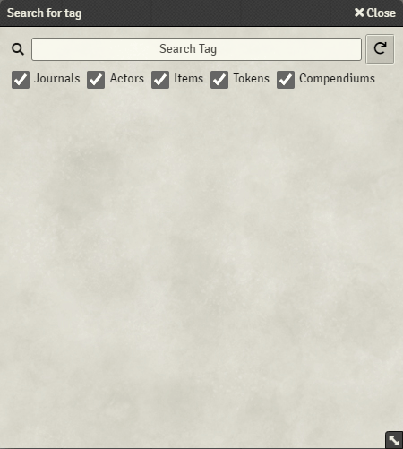
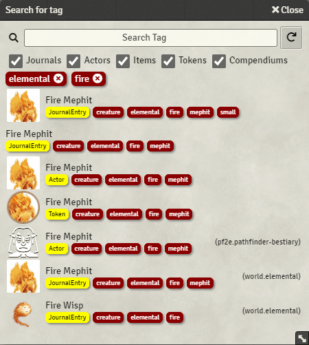

<!--- Downloads @ Latest Badge -->
<!--- replace <user>/<repo> with your username/repository -->

<!--- Forge Bazaar Install % Badge -->
<!--- replace <your-module-name> with the `name` in your manifest -->

# TagIt!

A module to tag entities and then search for them.

* Add tags to JournalEntries, Actors, Items, Tokens, and Compendium entires
* Search for tags by pressing Ctrl-Shift-F
* Open items from search
* Drag them to where you need

# Demo

## Search

Search for items by tag, opening them directly from the search panel.

## Add Tag to Entity

Add an existing or new tag.

* Open entity
* Click `Tags` on the title bar
* Select an already existing tag or create your own
* Close to save

This demo searched for the tag `small`, which does not exist.  We open a journal and add that new tag.  We click refresh in the search to see the results.

## Multiple Tags

Include only entities with all tags.

## Entity Filter

Filter results by entity type.

# TODO

* Enable drag and drop
* Add search capability for any flag

# Compatibility

* PF2e - Tested
* DnD5e - Tested
* Any system that does not make significant changes to the way JournalEntries, Actors, Items, Tokens, and Compendiums are accessed.

# Changelog

## V0.1.0
The beginning

## v0.2

* Standardized tags to `span` objects to be used throughout
* Included all tags on search
* Entity type is visually represented as a tag
* Can manage tags in module settings including
  * Renaming tags
  * Removing individual tags
* Remove all tags in module settings